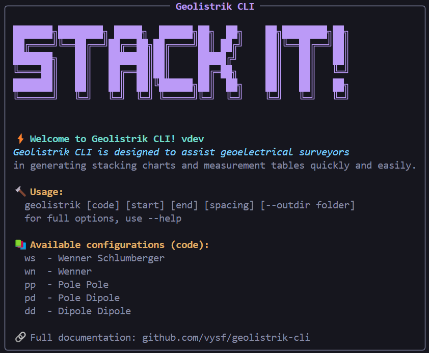

<p align="center">

</p>

<!-- <h1 align="center">Geolistrik CLI</h1> -->
<p align="center">
    <a href="https://github.com/vysf/geolistrik-cli/releases/latest" alt="Latest Release" style="text-decoration:none;">
        
    </a>
    <a href="https://github.com/vysf/geolistrik-cli/issues" alt="Open Issues" style="text-decoration:none;">
        
    </a>
    <a href="https://github.com/vysf/geolistrik-cli/blob/master/LICENSE" alt="License" style="text-decoration:none;">
        
    </a>
    <a href="https://github.com/vysf/geolistrik-cli?tab=readme-ov-file#contributing" alt="Contributions" style="text-decoration:none;">
        
    </a>
    <a href="https://github.com/vysf/geolistrik-cli/commits" alt="Last Commit" style="text-decoration:none;">
        
    </a>
</p>


<p align="center">
<a href="https://github.com/vysf/geolistrik-cli/blob/master/README.md">English</a> |
<a href="https://github.com/vysf/geolistrik-cli/blob/master/docs/indonesian.md">Bahasa Indonesia</a>
</p>


---

## 📑 Table of Contents

- [Introduction](#introduction)
- [Features](#features)
- [Installation Guide](#installation-guide)
  - [Windows](#windows)
  - [Linux](#linux)
- [Usage Example](#usage-example)
- [Notes for Users Migrating from v1](#notes-for-users-migrating-from-v1)
- [Local Development](#local-development)
- [Contributing](#contributing)

---

## Introduction

**Geolistrik CLI** is a command-line utility to generate **stacking charts** and **electrode configuration tables** for five common resistivity methods in geophysical survey:

- Wenner-Schlumberger (`ws`)
- Wenner (`wn`)
- Pole-Pole (`pp`)
- Pole-Dipole (`pd`)
- Dipole-Dipole (`dd`)

It saves outputs in `.png` (chart) and `.xlsx` (data) formats.

---

## Features

✅ Support 5 geoelectrical array configurations (Wenner, Wenner–Schlumberger, Pole–Pole, Pole–Dipole, Dipole–Dipole) \
✅ Explicit and self-documented CLI commands (`generate` and `update`) \
✅ Flexible input via options (safe and scalable for future versions) \
✅ Optional chart generation (`--no-plot`) \
✅ Custom output directory support (`--outdir`) \
✅ Output formats:
   1. `.png` stacking chart
   2. `.xlsx` measurement table

✅ Automatic update checking after command execution \
✅ Designed for students, researchers, surveyors, and geophysics practitioners \ 
✅ Cross-platform support (Windows & Linux)

---

## Installation Guide

### Windows

📦 [Download Installer](https://github.com/vysf/geolistrik-cli/releases)

1. Run the installer and follow the instructions.
2. After the installation is complete, manually add the following folder:
   ```
   C:\Program Files (x86)\Geolistrik
   ```
   to your [**system PATH**](https://www.bodhost.com/kb/how-to-add-to-the-path-on-windows-10-and-windows-11/) manually. This the tutorial:   
   - Click Start, type "env", and select `Edit the system environment variables`
   
   - In the System Properties window, click the `Environment Variables…` button
   
   - Under the System Variables section, find `Path` and click `Edit`
   
   - In the Edit Environment Variable window, click New to add a new path
   
   - Close all dialogue boxes by clicking `OK` to save your changes
   - Restart terminal to ensure the PATH changes take effect
3. Open CMD and type:
   ```cmd
   geolistrik
   ```
   You'll see the welcome banner:
   

4. Uninstall:
   - Uninstall via **Control Panel → Uninstall a Program**
   - Remove the path entry from the [**system PATH**](https://www.bodhost.com/kb/how-to-add-to-the-path-on-windows-10-and-windows-11/)

---

### Linux

📦 [Download Linux binary](https://github.com/vysf/geolistrik-cli/releases)

1. Make the file executable   
For example, if the file is in the `~/Downloads` folder:
   ```bash
   chmod +x ~/Downloads/geolistrik-linux-1.0.0.bin
   ```

2. Move the file to a directory in your PATH
Typically this would be `~/.local/bin` (for local install) or `/usr/local/bin` (for global install).
   - Global installation (for all users):
      ```bash
      sudo mv ~/Downloads/geolistrik-linux-1.0.0.bin /usr/local/bin/geolistrik
      ```
   - Local installation (for current user only):
      First, ensure `~/.local/bin` is included in your `$PATH`. Check with:
      ```bash
      echo $PATH
      ```
      If it’s not included, add it to your `.bashrc` or `.zshrc`:
      ```bash
      echo 'export PATH="$HOME/.local/bin:$PATH"' >> ~/.bashrc
      source ~/.bashrc
      ```
      If it is already included, simply run:
      ```bash
      mkdir -p ~/.local/bin
      mv ~/Downloads/geolistrik-linux-1.0.0.bin ~/.local/bin/geolistrik
      ```
      Now you can use the CLI from anywhere:
      ```bash
      geolistrik
      ```
      Just like on Windows, you should see a welcome banner.
3. Uninstall   
   Simply delete the binary from your system:
   ```bash
   sudo rm /usr/local/bin/geolistrik
   ```

---

## Usage Example

Geolistrik CLI uses a **command-based** structure.
The main command for data generation is `generate`.

### Basic Syntax
```bash
geolistrik generate \
  --configuration <code> \
  --start-position <start> \
  --end-position <end> \
  --spacing <spacing> \
  [--outdir <directory>] \
  [--no-plot] \
  [--verbose]
```
or for simple command
```
geolistrik generate \
  --c <code> \
  --s <start> \
  --e <end> \
  --s <spacing> \
  [-o <directory>] \
  [--no-plot] \
  [--verbose]
```

### Configuration Codes
| Code | Configuration       |
| ---- | ------------------- |
| wn   | Wenner              |
| ws   | Wenner–Schlumberger |
| pp   | Pole–Pole           |
| pd   | Pole–Dipole         |
| dd   | Dipole–Dipole       |

### Generate Stacking Chart and Measurement Table

By default, this command generates:
1. A stacking chart image (.png)
2. A measurement table (.xlsx)

```bash
geolistrik generate \
  --configuration ws \
  --start-position 0 \
  --end-position 100 \
  --spacing 10
```
or
```bash
geolistrik generate -c ws -s 0 -e 100 -a 10
```
The output files will be saved in the current directory with naming format:

- `ws_0_100_a10.png`
- `ws_0_100_a10.xlsx`

This table represents the actual electrode configuration and data acquisition sequence used in the field:


### Generate Only Measurement Tables (No Plot)
Use the `--no-plot` option to skip chart generation:

```bash
geolistrik generate \
  --configuration ws \
  --start-position 0 \
  --end-position 100 \
  --spacing 10 \
  --no-plot
```
or
```bash
geolistrik generate -c ws -s 0 -e 100 -a 10 --no-plot
```
This will generate only the `.xlsx` measurement table.

### Custom Output Directory
Specify a custom output directory using `--outdir`:

```bash
geolistrik generate \
  --configuration ws \
  --start-position 0 \
  --end-position 100 \
  --spacing 10 \
  --outdir "./results"
```
or
```bash
geolistrik generate -c ws -s 0 -e 100 -a 10 --outdir "./results"
```
All generated files will be saved inside the specified directory.

### Update CLI Version
To update Geolistrik CLI to the latest version:
```bash
geolistrik update
```
To install a specific version (upgrade or downgrade):
```bash
geolistrik update --version v1.0.1
```

---
## Notes for Users Migrating from v1

In version v1, parameters were provided as positional arguments:
```bash
geolistrik 0 100 10
```
Starting from v2, Geolistrik CLI adopts an **explicit command-based and option-based interface** for better clarity, safety, and long-term maintainability.

---

## Local Development

1. Clone this repository:
   ```bash
   git clone https://github.com/vysf/geolistrik-cli
   cd geolistrik-cli
   ```

2. Install dependencies:
   ```bash
   pip install -r requirements.txt
   ```

3. Run locally:
   ```bash
   python -m geolistrik --help
   ```

4. Build with Nuitka:
   See `build.bat` or use:

   ```bash
   nuitka --standalone --onefile --include-package=geolistrik --output-dir=build geolistrik/__main__.py
   ```

5. Compile Windows Installer:
   - Requires [Inno Setup](https://jrsoftware.org/isinfo.php)
   - Run:
     ```bash
     ISCC geolistrik_setup.iss
     ```

---

## Contributing

PRs are welcome!

### How to contribute:
- Fork this repository
- Commit changes to a branch
- Submit a pull request
- Or open an issue to report bugs/suggestions

---

📫 Contact: **Yusuf Umar Al Hakim**  
✉️ yusufumaralhakim@fmipa.untan.ac.id   
🌐 [GitHub Project](https://github.com/vysf/geolistrik-cli)
