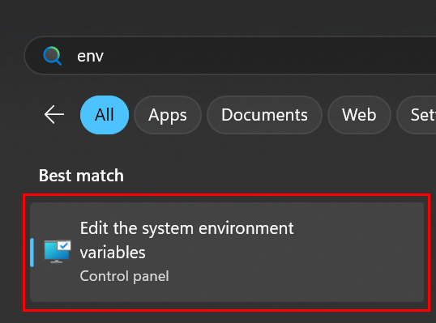
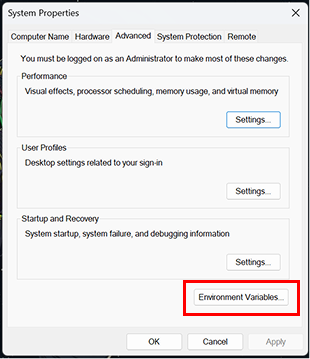
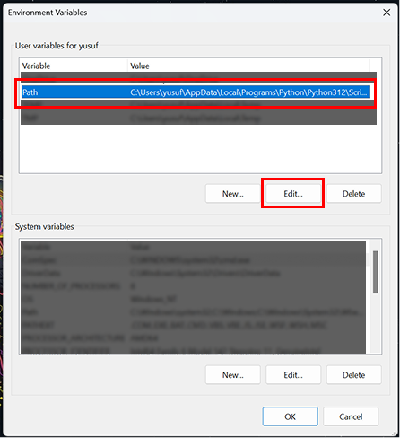
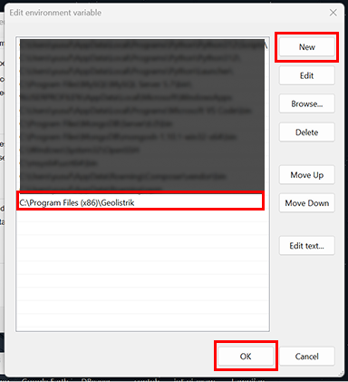

<p align="center">

</p>

<p align="center">
    <a href="https://github.com/vysf/geolistrik-cli/releases/latest" alt="Latest Release">
        
    </a>
    <a href="https://github.com/vysf/geolistrik-cli/issues" alt="Open Issues">
        
    </a>
    <a href="https://github.com/vysf/geolistrik-cli/blob/master/LICENSE" alt="License">
        
    </a>
    <a href="https://github.com/vysf/geolistrik-cli/blob/master/docs/indonesian.md#kontribusi" alt="Contributions">
        
    </a>
    <a href="https://github.com/vysf/geolistrik-cli/commits" alt="Last Commit" style="text-decoration:none;">
        
    </a>
</p>

<p align="center">
<a href="https://github.com/vysf/geolistrik-cli/blob/master/README.md">English</a> |
<a href="https://github.com/vysf/geolistrik-cli/blob/master/docs/indonesian.md">Bahasa Indonesia</a>
</p>


---

## 📑 Table of Contents

- [Perkenalan](#perkenalan)
- [Fitur](#fitur)
- [Cara Instalasi](#cara-instalasi)
  - [Windows](#windows)
  - [Linux](#linux)
- [Cara Update](#cara-update)
- [Contoh Penggunaan](#contoh-penggunaan)
- [Catatan Untuk Pengguna yang Bermigrasi Dari v1](#catatan-untuk-pengguna-yang-bermigrasi-dari-v1)
- [Pengembangan Lokal](#pengembangan-lokal)
- [Kontribusi](#kontribusi)

---
## Perkenalan

**Geolistrik CLI** adalah aplikasi berbasis terminal untuk menghasilkan **stacking chart** dan **tabel konfigurasi elektroda** dari metode geolistrik umum:

- Wenner-Schlumberger (`ws`)
- Wenner (`wn`)
- Pole-Pole (`pp`)
- Pole-Dipole (`pd`)
- Dipole-Dipole (`dd`)

Hasil disimpan dalam `.png` dan `.xlsx`.

---

### Fitur:

✅ Mendukung 5 konfigurasi susunan geolistrik (Wenner, Wenner–Schlumberger, Pole–Pole, Pole–Dipole, Dipole–Dipole)\
✅ Perintah CLI yang eksplisit dan terdokumentasi sendiri (`generate` dan `update`)\
✅ Input fleksibel melalui opsi (aman dan dapat diskalakan untuk versi mendatang)\
✅ Pembuatan grafik opsional (`--no-plot`)\
✅ Dukungan direktori output kustom (`--outdir`)\
✅ Format output:
   1. `.png` grafik tumpukan
   2. `.xlsx` tabel pengukuran

✅ Pemeriksaan pembaruan otomatis setelah eksekusi perintah\
✅ Dirancang untuk mahasiswa, peneliti, surveyor, dan praktisi geofisika\
✅ Dukungan lintas platform (Windows & Linux)

---

### Cara Instalasi

#### Windows

📦 [Download Installer](https://github.com/vysf/geolistrik-cli/releases)

1. Jalankan installer, ikuti petunjuk. 
2. Setelah instalasi selesai, tambahkan folder:
   ```
   C:\Program Files (x86)\Geolistrik
   ```
   ke [**system PATH**](https://www.bodhost.com/kb/how-to-add-to-the-path-on-windows-10-and-windows-11/)  secara manual, caranya:    
   - Klik Start, ketik "env", dan pilih `Edit the system environment variables`
   
   - Dalam System Properties, klik tombol `Environment Variables…`.
   
   - Didalam bagian System Variables, cari `Path` dan klik `Edit`
   
   - Didalam jendela Edit Environment Variable, klik `New` untuk menambah path baru.
   
   - Tutup semua kota dialog dengan klik `OK` untuk menyimpan perubahan mu.
   - Restart terminal untuk memastikan perubahan PATH berlaku.

3. Buka CMD dan ketik:
   ```cmd
   geolistrik
   ```
   Kamu akan melihat welcome banner:
   
4. Uninstall:
   - uninstall lewat **Control Panel → Uninstall a Program**
   - Hapus path yang path dari [**system PATH**](https://www.bodhost.com/kb/how-to-add-to-the-path-on-windows-10-and-windows-11/)

#### Linux

📦 [Download Linux binary](https://github.com/vysf/geolistrik-cli/releases)

1. Beri izin eksekusi file  
   Misalnya file ada di folder `~/Downloads`
   ```bash
   chmod +x ~/Downloads/geolistrik-linux-1.0.0.bin
   ```

2. Pindahkan ke folder yang ada di PATH  
Umumnya `~/.local/bin` atau `/usr/local/bin` (butuh `sudo` untuk global install):   
   - Instalasi Global (untuk semua user)
      ```bash
      sudo mv ~/Downloads/geolistrik-linux-1.0.0.bin /usr/local/bin/geolistrik
      ```
   - Instalasi Lokal (hanya untuk user saat ini)   
      sebelumnya pastikan dulu `~/.local/bin` sudah ada di `$PATH`. Cek dengan:
      ```bash
      echo $PATH
      ```
      Kalau belum ada, tambahkan ke `.bashrc` atau `.zshrc`:
      ```bash
      echo 'export PATH="$HOME/.local/bin:$PATH"' >> ~/.bashrc
      source ~/.bashrc
      ```
      Namun jika `~/.local/bin` sudah ada di `$PATH`, maka bisa langsung menjalankan perintah ini:
      ```bash
      mkdir -p ~/.local/bin
      mv ~/Downloads/geolistrik-linux-1.0.0.bin ~/.local/bin/geolistrik
      ```

      Kemudian gunakan CLI dimana saja:
      ```bash
      geolistrik
      ```
      Maka sama seperti diatas, kamu akan melihat `welcome banner`.
3. Uninstall
cukup hapus `/usr/local/bin/geolistrik` dari komputer anda.
   ```
   sudo rm /usr/local/bin/geolistrik
   ```
---

### Cara Update
1. Cek update lewat `geolistrik` atau `geolistrik --version`
2. Jika ada versi baru, buka: [GitHub Releases](https://github.com/vysf/geolistrik-cli/releases/latest)
3. Download installer terbaru sesuai OS Anda
4. Jalankan installer (Windows) atau ganti file binary (Linux)


---

## Contoh Penggunaan

Geolistrik CLI menggunakan struktur **command-based**.
Perintah utama untuk menghasilkan data adalah `generate`.

### Sintaks Dasar
```bash
geolistrik generate \
  --configuration <code> \
  --start-position <start> \
  --end-position <end> \
  --spacing <spacing> \
  [--outdir <directory>] \
  [--no-plot] \
  [--verbose]
```
atau untuk lebih singkat
```
geolistrik generate \
  -c <code> \
  -s <start> \
  -e <end> \
  -a <spacing> \
  [-o <directory>] \
  [--no-plot] \
  [--verbose]
```

### Kode Konfigurasi
| Kode | Konfigurasi       |
| ---- | ------------------- |
| wn   | Wenner              |
| ws   | Wenner–Schlumberger |
| pp   | Pole–Pole           |
| pd   | Pole–Dipole         |
| dd   | Dipole–Dipole       |

### Buat Stacking Chart dan Tabel Pengukuran

Secara default, perintah ini menghasilkan:
1. Sebuah gambar stacking chart (.png)
2. Sebuah tabel pengukuran (.xlsx)

```bash
geolistrik generate \
  --configuration ws \
  --start-position 0 \
  --end-position 100 \
  --spacing 10
```
or
```bash
geolistrik generate -c ws -s 0 -e 100 -a 10
```
File output akan disimpan di direktori saat ini dengan format penamaan:

- `ws_0_100_a10.png`
- `ws_0_100_a10.xlsx`

Tabel ini mewakili konfigurasi elektroda dan urutan akuisisi data aktual yang digunakan di lapangan:


### Membuat Tabel Pengukuran Saja (No Plot)
Gunakan opsi `--no-plot` untuk melewati pembuatan grafik:

```bash
geolistrik generate \
  --configuration ws \
  --start-position 0 \
  --end-position 100 \
  --spacing 10 \
  --no-plot
```
atau
```bash
geolistrik generate -c ws -s 0 -e 100 -a 10 --no-plot
```
Ini hanya akan menghasilkan tabel pengukuran `.xlsx`.

### Direktori Keluaran Khusus
Tentukan direktori keluaran khusu menggunakan `--outdir`:

```bash
geolistrik generate \
  --configuration ws \
  --start-position 0 \
  --end-position 100 \
  --spacing 10 \
  --outdir "./results"
```
atau
```bash
geolistrik generate -c ws -s 0 -e 100 -a 10 --outdir "./results"
```
Semua file yang dihasilkan akan didimpan di dalam direktori yang ditentukan.

### Update CLI Version
Untuk update Geolistrik CLI ke versi terbaru:
```bash
geolistrik update
```
Untuk isntall versi spesifik (upgrade or downgrade):
```bash
geolistrik update --version 1.0.1
```

---
## Catatan Untuk Pengguna yang Bermigrasi Dari v1

Pada v1, parameter diberikan sebagai argumen posisional:
```bash
geolistrik 0 100 10
```
Mulai dari versi 2, Geolistrik CLI mengadopsi **explicit command-based dan option-based interface** untuk kejelasan, keamanan, dan pemeliharaan jangka panjang yang lebih baik.

---

### Pengembangan Lokal

1. Clone repositori ini:
   ```bash
   git clone https://github.com/vysf/geolistrik-cli
   cd geolistrik-cli
   ```

2. Install dependencies:
   ```bash
   pip install -r requirements.txt
   ```

3. Run secara lokal:
   ```bash
   python -m geolistrik --help
   ```

4. Build dengan Nuitka:
   See `build.bat` or use:

   ```bash
   nuitka
   --standalone
   --onefile
   --include-package=geolistrik
   --windows-icon-from-ico=assets\icon.ico
   --output-dir=build
   geolistrik\__main__.py
   ```

5. Membuat Installer Windows:
   - Requires [Inno Setup](https://jrsoftware.org/isinfo.php)
   - Run:
     ```bash
     ISCC geolistrik_setup.iss
     ```
   Jika di Linux, hasil kompilasi Nuitka menghasilkan binary executable.

---

### Kontribusi

Kami menerima kontribusi dalam bentuk:
- Perbaikan bug
- Penambahan fitur
- Dokumentasi
- Terjemahan

Silakan buka *Issue* atau *Pull Request* untuk memulai.

---

📫 Kontak: **Yusuf Umar Al Hakim**  
✉️ yusufumaralhakim@fmipa.untan.ac.id 
🌐 [GitHub Project](https://github.com/vysf/geolistrik-cli)
