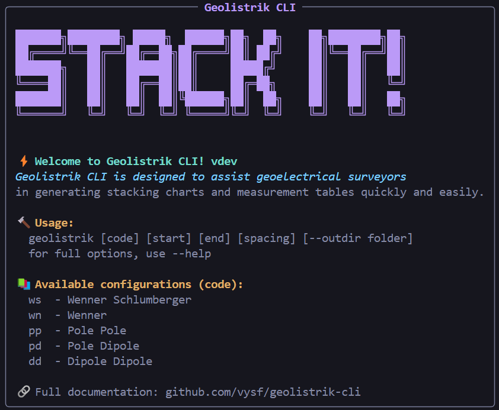

<p align="center">

</p>

<h1 align="center">Geolistrik CLI</h1>
<p align="center">
    <a href="https://github.com/vysf/geolistrik-cli/releases/latest" alt="Latest Release">
        
    </a>
    <a href="https://github.com/vysf/geolistrik-cli/issues" alt="Open Issues">
        
    </a>
    <a href="https://github.com/vysf/geolistrik-cli/blob/master/LICENSE" alt="License">
        
    </a>
    <a href="https://github.com/vysf/geolistrik-cli/blob/master/docs/indonesian.md#kontribusi" alt="Contributions">
        
    </a>
    <a href="https://github.com/vysf/geolistrik-cli/commits" alt="Last Commit" style="text-decoration:none;">
        
    </a>
</p>

<p align="center">
Hasilkan stacking chart geolistrik dan tabel observasi dari terminal.
</p>

<p align="center">
<a href="https://github.com/vysf/geolistrik-cli/blob/master/README.md">English</a> |
<a href="https://github.com/vysf/geolistrik-cli/blob/master/docs/indonesian.md">Bahasa Indonesia</a>
</p>


---

## 📑 Table of Contents

- [Perkenalan](#perkenalan)
- [Fitur](#fitur)
- [Cara Instalasi](#cara-instalasi)
  - [Windows](#windows)
  - [Linux](#linux)
- [Cara Update](#cara-update)
- [Contoh Penggunaan](#contoh-penggunaan)
   - [Membuat Stacking Chart dan Tabel Pengukuran](#membuat-stacking-chart-dan-tabel-pengukuran)
   - [Hanya Menghasilkan Tabel Pengukuran](#hanya-menghasilkan-tabel-pengukuran)
   - [Menyimpan ke Direktori Khusus](#menyimpan-ke-direktori-khusus)
- [Pengembangan Lokal](#pengembangan-lokal)
- [Kontribusi](#kontribusi)

---
## Perkenalan

**Geolistrik CLI** adalah aplikasi berbasis terminal untuk menghasilkan **stacking chart** dan **tabel konfigurasi elektroda** dari metode geolistrik umum:

- Wenner-Schlumberger (`ws`)
- Wenner (`wn`)
- Pole-Pole (`pp`)
- Pole-Dipole (`pd`)
- Dipole-Dipole (`dd`)

Hasil disimpan dalam `.png` dan `.xlsx`.

---

### Fitur:

- Mendukung 5 konfigurasi elektroda
- CLI dengan opsi `--no-plot`, `--outdir`
- Ekspor grafik `.png` dan data `.txt`
- Bisa digunakan di Windows & Linux

---

### Cara Instalasi

#### Windows

📦 [Download Installer](https://github.com/vysf/geolistrik-cli/releases)

1. Jalankan installer, ikuti petunjuk. 
2. Setelah intalaso selesai, tambahkan folder:
  ```
  C:\Program Files\Geolistrik 1.0.0   
  ```
  ke [**system PATH**](https://www.bodhost.com/kb/how-to-add-to-the-path-on-windows-10-and-windows-11/)  secara manual.
3. Buka CMD dan ketik:
   ```cmd
   geolistrik
   ```
   Kamu akan melihat welcome banner:
   
4. Untuk uninstall:
   - uninstall lewat **Control Panel → Uninstall a Program**
   - Hapus path yang path dari [**system PATH**](https://www.bodhost.com/kb/how-to-add-to-the-path-on-windows-10-and-windows-11/)

#### Linux

📦 [Download Linux binary](https://github.com/vysf/geolistrik-cli/releases)

```bash
chmod +x geolistrik-linux
sudo mv geolistrik-linux /usr/local/bin/geolistrik
```

Kemudian gunakan CLI dimana saja:
```bash
geolistrik ws 0 100 10 --outdir results/
```

---

### Cara Update
1. Cek update lewat `geolistrik` atau `geolistrik --version`
2. Jika ada versi baru, buka: [GitHub Releases](https://github.com/vysf/geolistrik-cli/releases/latest)
3. Download installer terbaru sesuai OS Anda
4. Jalankan installer (Windows) atau ganti file binary (Linux)


---

### Contoh Penggunaan

```bash
geolistrik [config] [min] [max] [spacing] [--outdir DIR] [--no-plot]
```

### Kode Konfigurasi:

| Code | Configuration        |
|------|----------------------|
| ws   | Wenner-Schlumberger |
| wn   | Wenner              |
| pp   | Pole-Pole           |
| pd   | Pole-Dipole         |
| dd   | Dipole-Dipole       |

### Options:

| Option       | Description                                |
|--------------|--------------------------------------------|
| `--outdir`   | Set output directory for files             |
| `--no-plot`  | Skip plotting `.png`, just generate data   |
| `--version`  | Show app version                           |
| `--about`    | Show app metadata                          |

### Membuat Stacking Chart dan Tabel Pengukuran
Secara default, perintah ini akan menghasilkan:
- File gambar (`[config]_[min]_[max]_a[space].png`)
- Tabel data (`[config]_[min]_[max]_a[space].xlsx`)

Anda cukup menjalankan perintah dibawah ini
```bash
geolistrik ws 0 100 10
```

### Hanya Menghasilkan Tabel Pengukuran
Gunakan `--no-plot` untuk menonaktifkan pembuatan grafik:
```bash
geolistrik ws 0 100 10 --no-plot
```

### Menyimpan ke Direktori Khusus
Seperti yang telah dijelaskan di [Membuat Stacking Chart dan Tabel Pengukuran](#membuat-stacking-chart-dan-tabel-pengukuran), tambahkan `--outdir` untuk menentukan folder output:

```bash
geolistrik ws 0 100 10 --outdir "./my_dir"
```
Jangan ragu untuk mengkombinasikan dengan flag lainya.

---

### Pengembangan Lokal

1. Clone repositori ini:
   ```bash
   git clone https://github.com/vysf/geolistrik-cli
   cd geolistrik-cli
   ```

2. Install dependencies:
   ```bash
   pip install -r requirements.txt
   ```

3. Run secara lokal:
   ```bash
   python -m geolistrik --help
   ```

4. Build dengan Nuitka:
   See `build.bat` or use:

   ```bash
   nuitka
   --standalone
   --onefile
   --include-package=geolistrik
   --windows-icon-from-ico=assets\icon.ico
   --output-dir=build
   geolistrik\__main__.py
   ```

5. Membuat Installer Windows:
   - Requires [Inno Setup](https://jrsoftware.org/isinfo.php)
   - Run:
     ```bash
     ISCC geolistrik_setup.iss
     ```
   Jika di Linux, hasil kompilasi Nuitka menghasilkan binary executable.

---

### Kontribusi

Kami menerima kontribusi dalam bentuk:
- Perbaikan bug
- Penambahan fitur
- Dokumentasi
- Terjemahan

Silakan buka *Issue* atau *Pull Request* untuk memulai.

---

📫 Kontak: **Yusuf Umar Al Hakim**  
✉️ yusufumaralhakim@fmipa.untan.ac.id.com  
🌐 [GitHub Project](https://github.com/vysf/geolistrik-cli)
